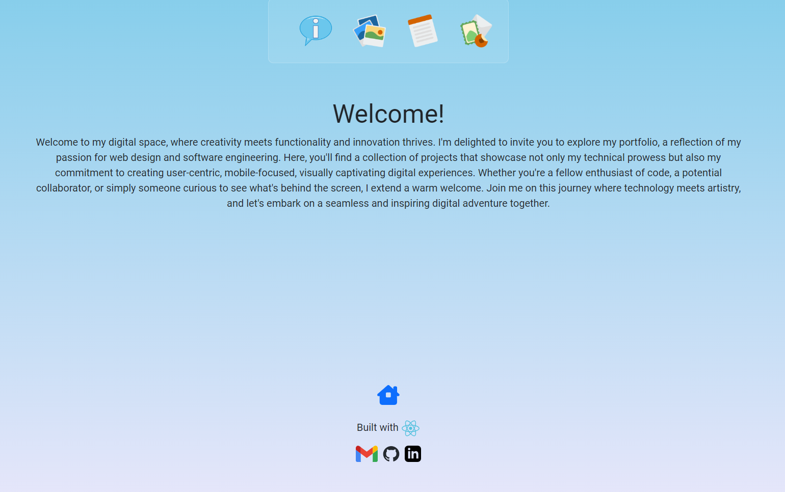
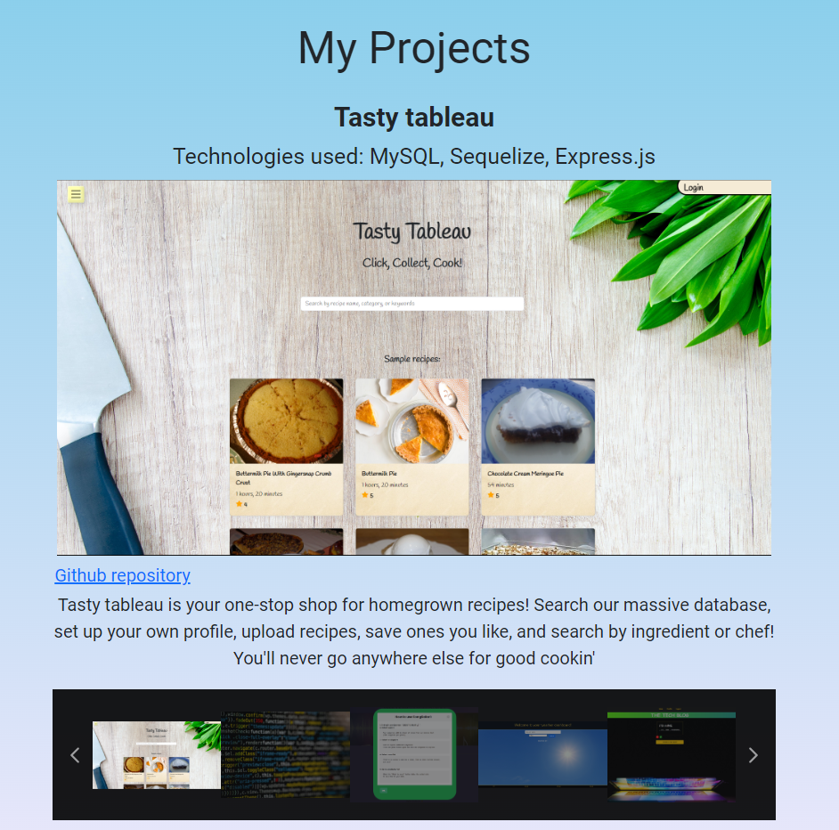
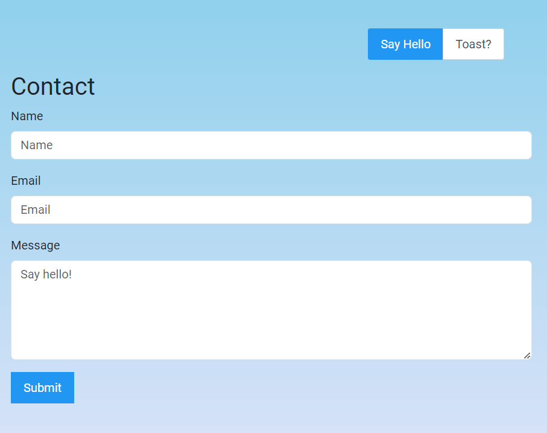

# Kurt Riecken - React Portfolio 
  
## Description
  
This project is an expression of myself as a web designer and developer. I strive for clean, mobile-forward applications that guide the user in both form and function to the websites' central purpose, whatever that may be. I am always in search of new technologies and interfaces to explore and learn, both for a sense of personal enjoyment and fulfillment and in an effort to deliver the optimal solutions to my clients for their specific needs.
  
## Table of Contents
  
-[Installation](#installation)
  
-[Usage](#usage)
  
-[License](#license)
  
-[Credits](#credits)
  
-[Contributions](#how-to-contribute)
  
## Installation
  
No installation is necessary! Simply follow [this link](https://kurtrieckenportfolio.netlify.app/) to be taken to the deployed application.
  
## Usage
  
Navigate through my portfolio to your heart's content! Upon entering, you will be greeted with a welcome page, with a message in the center and links to the rest of my site at the top in the dock. Click the home icon at the bottom of the screen at anytime to return to the main page. In addition, there are links to my email, GitHub, and LinkedIn at the very bottom of every page.

The 'About Kurt' section details some fun things you may not know about me! My interests lie primarily in software and web development but they extend to many things in addition. If we share some ground here or if you'd just like to get to know each, please reach out using the contact card on the last page!

The 'Projects section includes a carousel of my most recent projects for display and your perusal. Information includes technology stack, github repository, and a screenshot that links directly to the deployed application.

The 'Resume' page includes a link to download my current resume. And finally, the 'Contact Kurt' page includes a brief form you can fill out to send me a message. Please include your name, email, and anything you would like to say!

Click the 'Toast?' button at the top here for a fun easter egg...

## License

[This project uses the following license: MIT](https://opensource.org/licenses/MIT)

## How to Contribute
  
Please contact me on github or through my email listed below if you have any ideas or want to help extend my project!

## Questions

[Please follow this link to my GitHub profile!](https://github.com/kurtriecken)

For any additional questions, please [email me here.](mailto:kurt.riecken@gmail.com)

## Credits
  
[Kurt Riecken](https://github.com/kurtriecken)
